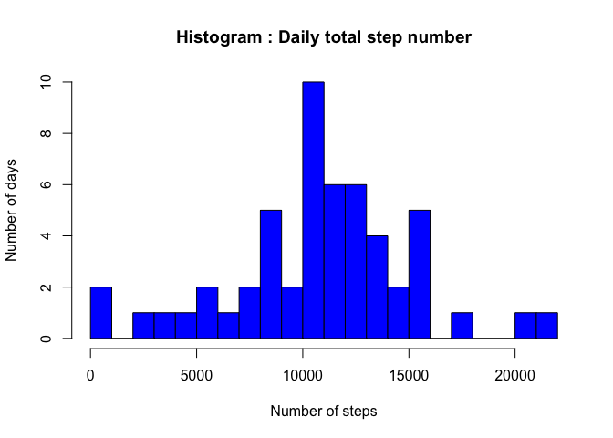
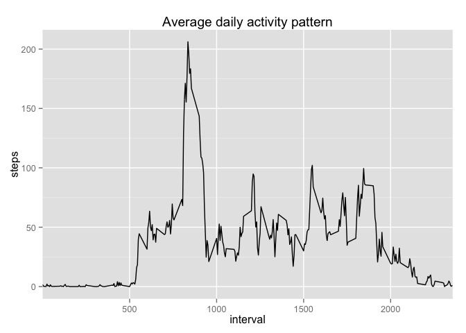
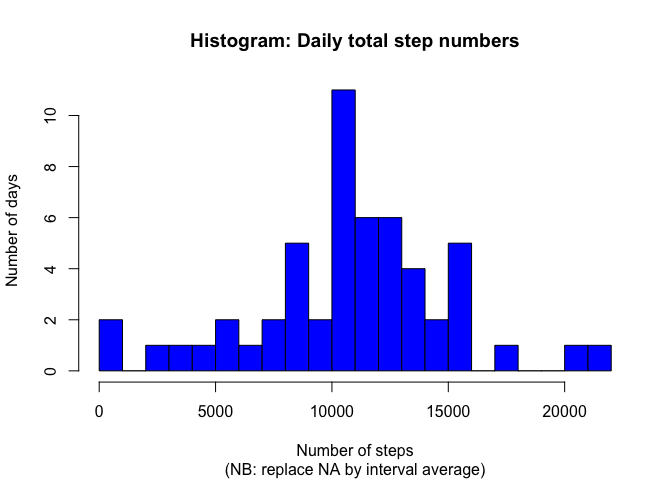
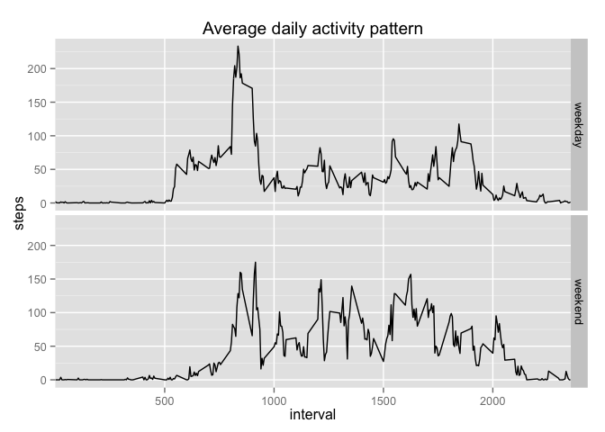

# Reproducible Research: Peer Assessment 1

===

## Loading and preprocessing the data
The data is load from the unzip *activity.csv* file.
The only preprocessing made was to transforme the variable date in the Date format.


```r
AMD <- read.csv("activity.csv", sep = ",")
AMD$date <- as.Date(AMD$date)
```


## What is mean total number of steps taken per day?

A new data frame was created to sum by day the number of step count from all the day's intervals.

For the computation of mean and median, the NA value were exclude.


```r
library(plyr)
AMD_daily_tot <- ddply(AMD, .(date), summarize, steps = sum(steps))
meanTOT <- mean(AMD_daily_tot$steps, na.rm = TRUE)
medianTOT <- median(AMD_daily_tot$steps, na.rm = TRUE)

# Total number of steps taken per day
meanTOT
```

```
## [1] 10766.19
```

```r
medianTOT
```

```
## [1] 10765
```

The histogram represent the number of days for each interval of total step count.


```r
hist(AMD_daily_tot$steps, breaks = 30, 
    col = 'blue',
    ylab = "Number of days", 
    xlab = "Number of steps", 
    main = 'Histogram : Daily total step number')
```

 

## What is the average daily activity pattern?
The daily pattern could be seen by computing the average step count for each interval across the days of recording.


```r
AMD_interval_avg <- ddply(AMD, .(interval), summarize, steps = mean(steps, na.rm = TRUE))

maxstepcount <- max(AMD_interval_avg$steps, na.rm = TRUE)
maxInterval <- AMD_interval_avg$interval[AMD_interval_avg$steps == maxstepcount] 

# The maximal step count for an interval
maxstepcount
```

```
## [1] 206.1698
```

```r
#The corresponding 5-minute interval
maxInterval
```

```
## [1] 835
```

A time serie plot permits to observe the average step count in function of the day intervals.

```r
library(ggplot2)
g <- ggplot(AMD_interval_avg, aes(x = interval, y = steps)) + 
        geom_line() +    
        labs(title="Average daily activity pattern") +
        scale_x_discrete(breaks = c(500, 1000, 1500, 2000, 2500, 3000))
g
```

 

## Imputing missing values
The data set contains some missing values (NA).

The strategy used to fill in all the missing values was to replace the NA with the average value of the corresponding 5-minute interval.


```r
NAcount <- sum(is.na(AMD))

AMD_replaceNA <- AMD
AMD_replaceNA$steps[is.na(AMD_replaceNA$steps)] <- AMD_interval_avg$steps[is.na(AMD_replaceNA$steps)]

AMDreplace_daily_tot <- ddply(AMD_replaceNA, .(date), summarize, steps = sum(steps))
meanTOT_replace <- mean(AMDreplace_daily_tot$steps, na.rm = TRUE)
medianTOT_replace <- median(AMDreplace_daily_tot$steps, na.rm = TRUE)

# Number of missing values:
NAcount
```

```
## [1] 2304
```

```r
# Total number of steps taken per day
# (missing values replace with interval average)
meanTOT_replace
```

```
## [1] 10766.19
```

```r
medianTOT_replace
```

```
## [1] 10765.59
```

The results obtained with the missing data fill in didn't seam to differ from the previous results.

The histogram represent the number of days for each interval of total step count. The graph also looks as the previous one.


```r
hist(AMDreplace_daily_tot$steps, breaks = 30, 
    col = 'blue',
    ylab = "Number of days", 
    xlab = "Number of steps", 
    main = 'Histogram: Daily total step numbers',
    sub = '(NB: replace NA by interval average)')
```

 

## Are there differences in activity patterns between weekdays and weekends?

```r
# Set system to english
Sys.setlocale("LC_ALL", "en_US")
```

A new factor had been add to the data frame with the missing NA fill in. The factor determine if the data came from weekday days or weekend days. The variable was called days and it had two levels: weekend and weekday.


```r
days <- weekdays(AMD_replaceNA$date, abbr = TRUE)
days[(days == "Sat" | days == "Sun")] <- "weekend"
days[(days != "weekend")] <- "weekday"
AMD_replaceNA["days"] <- as.factor(days)
AMDreplace_interval_avg <- aggregate(steps ~ (interval + days) , AMD_replaceNA, mean)
```

Two time serie plots permit to observe the average step count in function of the day intervals for the weekend and for the weekdays. The graph observations show some differences in the pattern in function of if it's during the weekend or not. 


```r
library(ggplot2)
ggplot(AMDreplace_interval_avg, aes(x = interval, y = steps, group = days)) + 
        geom_line() +    
        facet_grid(days~.) + 
        labs(title="Average daily activity pattern") +
        scale_x_discrete(breaks = c(500, 1000, 1500, 2000, 2500, 3000))
```

 
